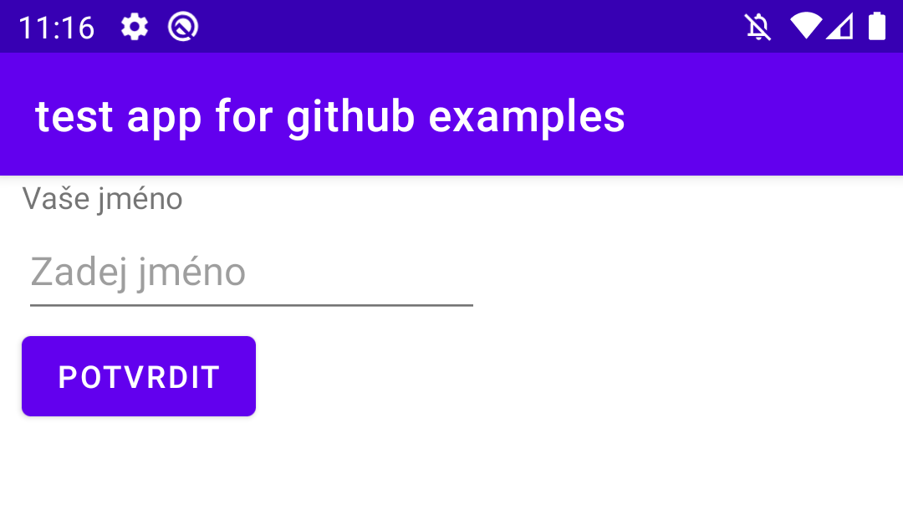
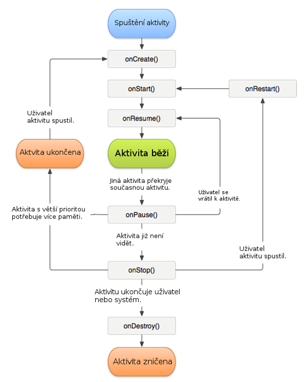

# 16 Programování Javy v Android zařízení

>Jazyk Java a mobilní technologie. Základní grafické rozhraní aplikace, aktivity (vytvoření, spuštění, modifikace, přesměrování do jiné aplikace, výsledek aktivity), fragmenty (vytvoření, komunikace). Ukládání klíčových hodnot, soubory, využití SQL. Práce s obrázky, animace, přechody, zvuk, využití fotoaparátu.
---
Android je mobilní operační systém založený na linuxovém jádře Linux kernel.
Nalezneme ho v nejrůznějších zařízení (chytré hodinky, palubní deska elektrických aut, mobilní telefony, navigace).
Architectura androidu se zkládá z 5 vrstev:

1. Applications
2. Aplication Framework
3. Knihovny
4. Android runtime
5. Jádro linux Kernel


## Jazyk Java

Objektově orientovaný programový jazyk.
Má následující vlastnosti:

- **jednoduchý** - jednoduchá syntaxe, odpadla nízkoúrovňové konstrukce
- **distribuvaný** - navržen pro podporu aplikací v síti
- **interpretovaný** - místo strojového kódu se vytváří bajtkód, tento bajtkód může být spuštěn virtualním strojem Javy
- **přenositelný** - je nezávislý na architektuře, operačním systému, je možné i přenést projekty mezi jednotlivými verzi Javy
- **víceúlohový** - podporuje zpracování vícevláknových aplikací
- **generační správa paměti** - zpráva paměři probíhá pomocí automatického garbage collectoru, který vyhledává nepoužité části paměti a uvolňuje ji pro další použití

## Mobilní technologie

---
Patří zde přenosná zařízení a bezdrátové připojení.
Mezi příklady bezdratového připojení lze uvést: Internet a bluetooth.
Přenosná zařízení jsou "zmenšené" verze stolního PC. Mají podobné komponenty a fungují na podobné architukteře jako PC. Jako příklad můžeme uvézt: Mobil, tablet a notebook.

Vybavení:

- mobil a tablet - dotyková obrazovka jako základní I/O, fotoaparát, napajecí konektor, baterie, RAM, ůložiště
- notebook - klávesnice, myš, webkamera, displej, reproduktory, USB porty, napájecí konektor, HDMI port, baterie

## Tvoření aplikace

---

Na tvoření aplikace musíme použít vhodnou metodu vývoje(webová, nativní, hybridní) a vhodné vývojové prostředí. Využívá se zde vývojového prostředí Android Studio. Android studio nám umožňuje debugovat, zvýrazňuje syntaxi, jednoduše stahovat SDK a správu virtualních zařízení. Pro správnou funkci virtualizace musíme povolit virtualizační technologii od intelu v BIOSU.

### Grafické komponenty aplikace

Pro vytovření aplikace můžeme použít několik komponent. Mezi nejzákladnější komponenty patří:

- TextView - zobrazuje text, uživatel tento text nemůže měnit
- EditText - dáva možnost uživateli zadat nějaký text, může se nastavit atribut android:hint="Zadej jmeno", tímto atributem napovíme uživateli co se po něm chce
- Button - tlačítko, dá se mu nastavit atribut OnClick(), který nám bude spouštět funkci pokud se na něj klikne

### Grafické rozhraní aplikace

Grafické rozhraní slouží pro jednodušší, kratší a efektivnější proces. Pomocí GUI usnadňujeme práci uživateli. Grafické rozhraní aplikace se nachází v .xml souboru. Funkčnost aplikace je psaná v MainActivity.java.

Příklad grafického rozhraní:



MainActivity.java kód:

```java
package com.example.testappforgithubexamples;

import androidx.appcompat.app.AppCompatActivity;
import android.os.Bundle;
import android.view.View;
import android.widget.Button;
import android.widget.EditText;
import android.widget.TextView;

public class MainActivity extends AppCompatActivity {
    EditText personName;
    TextView displayName;
    Button confirm;

    @Override
    protected void onCreate(Bundle savedInstanceState) {
        super.onCreate(savedInstanceState);
        setContentView(R.layout.activity_main);
        personName = findViewById(R.id.personName);
        confirm = findViewById(R.id.confirm);
        displayName = findViewById(R.id.displayName);
    }

    public void setName(View v) {
            displayName.setText(personName.getText());
    }
}
```

activity_main.xml:

```xml
<androidx.constraintlayout.widget.ConstraintLayout
    android:layout_width="wrap_content"
    android:layout_height="wrap_content"
    app:layout_constraintStart_toStartOf="parent"
    app:layout_constraintTop_toTopOf="parent">

    <TextView
        android:id="@+id/displayName"
        android:layout_width="wrap_content"
        android:layout_height="wrap_content"
        android:layout_marginStart="10dp"
        android:text="@string/yourName"
        app:layout_constraintStart_toStartOf="parent"
        app:layout_constraintTop_toTopOf="parent" />

    <EditText
        android:id="@+id/personName"
        android:layout_width="wrap_content"
        android:layout_height="wrap_content"
        android:hint="@string/inputName"
        android:ems="10"
        android:inputType="textPersonName"
        android:minHeight="48dp"
        app:layout_constraintStart_toStartOf="@+id/displayName"
        app:layout_constraintTop_toBottomOf="@+id/displayName" />

    <Button
        android:id="@+id/confirm"
        android:layout_width="wrap_content"
        android:layout_height="wrap_content"
        android:onClick="setName"
        android:text="@string/confirm"
        app:layout_constraintStart_toStartOf="@+id/personName"
        app:layout_constraintTop_toBottomOf="@+id/personName" />

</androidx.constraintlayout.widget.ConstraintLayout>
```

#### Aktivity

Jeden z 4 stavebních kamenů aplikace (content porivders, activities, services, broadcast providers). Popisuje jednu obrazovku aplikace.

##### Vytváření aktivity

Aktivita se vytváří volání metody onCreate(). Tato metoda přijimá jeden parametr savedInstanceState. Ten je po spuštění aplikace nulový a slouží pro ukládání stavu aplikace. Například změna orientace zařízení. V této metodě se taky používá metoda setContentView(), která nám definuje jaký obsah (GUI) bude vykreslen.

##### Výsledek aktivity

Výsledek aktivity se dá zobrazit v GUI prvcích aktivity. Pokud chceme výsledek poslat do jiné aktivity tak využijeme objektu **Intent** a jeho funkce **Intent.setData()**, která nám umožní poslat nějaké data do další aplikace.

Příklad nastavení výsledku na web itnetwork:

```java
Intent webIntent = new Intent(Intent.ACTION_VIEW);
webIntent.setData(Uri.parse("https://www.itnetwork.cz/"));
```

##### Přesměrování do jiné aktivity

K přesměrování aplikace využíváme objektu **Intent**. Tento objekt obashuje popis operace, která má být provedena. Intenty jsou jedním z prostředků sloužících k meziprocesové komunikaci, a neslouží pouze k otvírání aktivit. Dále můžeme Intent použít jako kontejner primitivních  dat.

Intent je objekt skládající se, v případě otevírání aktivit, ze dvou částí:

- akce - druh činnosti, která má být provedena (např. zobrazení webu)
- data - data, která potřebujeme aktivitě nebo systému předat (např URL webu)

###### Přechody mezi aplikacemi

Při použití animovaného přechodu použijeme funkci overridePendingTransition(android.R.anim.fade_in, android.R.anim.fade_out). Přičemž vstupem této funkce jsou konkrétní animace definované v .xml souobru.

##### Spuštění aktivity

Když už máme vytvořený objekt Intent tak můžeme použít funkci startActivity(), jejiž vstupním parametrem je právě udělaný intent.

```java
Intent webIntent = new Intent(Intent.ACTION_VIEW);
webIntent.setData(Uri.parse("https://www.itnetwork.cz/"));
startActivity(webIntent);
```

##### Cyklus aktivity



Události životního cyklu:

- **onCreate()** - stará se o vytvoření objektů a spuštění procesů
- **onStart()** - volá se pokud aktivita byla poprvé spuštěna
- **onResume()** - volá se těsne než je aktivita posunuta do popředí
- **onPause()** - volá se před přechodem aktivity do pozadí
- **onStop()** -  volá se, když se má aktivita zastavit, není viditelná pro uživatele
- **onRestart()** -  volá se při restartování aktivity
- **onDestroy()** - volá se před zrušením aktivity

#### Fragmenty

Fragment reprezentuje část nebo celé uživatelské rozhraní nějaké Activity i s příslušnými metodami. Na rozdíl od Activity se ale Fragment může stát součástí jiné Activity nebo Fragmentu. Díky tomu můžeme vytvářet flexibilní a znovupoužitelné jednotky uživatelského rozhraní. A tím pádem bez duplikace kódu programovat optimalizovaná rozhraní pro větší displeje (tablety, televize atd.).

Fragment má životní cyklus podobný Activity.

##### Vytvoření a komunikace fragmentů

Fragment se většinou vytvaří pomocí funkce onCreateView(), které vrací View, jež obaluje to, co má být z Fragmentu vidět. Fragment se instacuje přímo. Fragmenty komunikují buď mezi sebou, nebo můžou komunikovat přímo s aktivitou.

Komunikuje se pomocí:

- Obashu
- Sdilení dat pomocí ViewModel, sdílení dat s aktivitou hostitele, sdílení dat mezi fragmenty
- Získání výsledků pomocí rozhraní Fragment Result API, křerý předává výsledky mezi fragmenty.

Příklad třídy na fragmenty

```java
public class Menu1Fragment extends Fragment {

    @Override
    public View onCreateView(LayoutInflater inflater, ViewGroup container, Bundle savedInstanceState) {
        return inflater.inflate(R.layout.menu1_layout, container, false);
    }
}
```

#### Ukládání klíčových hodnot

Klíčové hodnoty se ukládají do adresáře res. Zde se nachází definice textů, barev a obrázků, které aktivita používa. Hodnoty se ukládají do .xml formátu. Základním souborem je strings.xml, kde jsou uloženy texty. Tyto texty jsou přeloženy do jazyka operačního systému.

---

## Práce s knihovny, soubory a obrázky

Při programování našich aplikací lze použít i nespočet knihoven a vylepšení, které seženeme na internetu.

### Práce se soubory

Se realizuje pomocí třídy FileOutputStream. Tato třída obsahuje metodu openFileOutput(cesta, režim), díky které můžeme otevřít .txt soubory. Vstupem této funkce je cesta daného souboru a režim ve kterém ho chceme otevřít.

```java
FileOutputStream fos;
fos = context.openFileOutput(Konstanty.nazevSouboru(), Context.MODE_PRIVATE);
```

### SQLite

Jedná se o  odlehčený systém řízený báze dat (SŘBD). Jako každý databázový systém je zde možné vytvářet databáze s určitou datovou structurou. Využívá se zde třídy SQLiteOpenHlepr, která zjednodušuje vytváření a otevírání databáze.

Potom deklarujeme třídu DatabaseHelper, která dědí od SQLiteOpenHelper a pomůže nám databázi vytvořit či otevřít. V onCreate  spustíme přímo SQL dotaz, který vytvoří tabulku s požadovanými sloupci požadovaného typu. Hodnota sloupce _id se bude nastavovat automaticky. V onUpgrade  zde jednoduše smažeme tabulku a vytvoříme novou.

```java
static class DatabaseHelper extends SQLiteOpenHelper {

    DatabaseHelper(Context context) {
        super(context, DATABASE_NAME, null, DATABASE_VERSION);
    }

    @Override
    public void onCreate(SQLiteDatabase db) {
        db.execSQL("CREATE TABLE " + TB_NAME + " ("
                + COLUMN_ID + " INTEGER PRIMARY KEY,"
                + COLUMN_TITLE + " TEXT NOT NULL,"
                + COLUMN_NOTE + " TEXT NOT NULL"
                + ");");
    }
}
```

### Obrázky

Využívá se zde komponenty imageView. Této komponentě se nastavuje atribut srcCompat, kde definujeme jaký obrázek se má vykreslit. Tento obrázek by se měl nacházet v složce res/drawable.

```xml
<ImageView
    android:id="@+id/ivTarget"
    android:layout_width="wrap_content"
    android:layout_height="wrap_content"
    app:srcCompat="@drawable/targetsmall"
    tools:layout_editor_absoluteX="121dp"
    tools:layout_editor_absoluteY="132dp" />
```

#### Animace

Definují se staticky v souboru res/drawable. Potom se zde vyžívá zde atributu AnimationDrawable.

```xml
<animation-list xmlns:android="http://schemas.android.com/apk/res/android"
    android:oneshot="true">
    <item android:drawable="@drawable/rocket_thrust1" android:duration="200" />
    <item android:drawable="@drawable/rocket_thrust2" android:duration="200" />
    <item android:drawable="@drawable/rocket_thrust3" android:duration="200" />
</animation-list>
```

### Zvuk

Využívá se zde třídy MediaPlayer. Dále se používá metody .create(), která nám zavolá konstruktor této třídy. Potom musíme definovat kdy se má zvuk přehrát, například při zmáčknutí tlačítka.

```java
import android.app.Activity;
import android.media.MediaPlayer;
import android.os.Bundle;
import android.view.Menu;
import android.view.View;
import android.view.View.OnClickListener;
import android.widget.Button;

public class BasicScreenActivity extends Activity {
    @Override
    protected void onCreate(Bundle savedInstanceState) {        
        super.onCreate(savedInstanceState);
        setContentView(R.layout.activity_basic_screen);

        Button one = (Button)this.findViewById(R.id.button1);
        final MediaPlayer mp = MediaPlayer.create(this, R.raw.soho);
        one.setOnClickListener(new OnClickListener(){

            public void onClick(View v) {
                mp.start();
            }
        });
    }
}
```

### Fotoaparát

Pro využití fotoaparátu je lepší použití nějaké aplikace, která byla pro tento účel vyvinuta. Pokud ale chceme vytvořit specialní aplikaci pro fotoaparát tak musíme si vytvořit instanci objektu Camera. Tuto instanci pak násladně budeme hodně přepisovat a je to realativně dost kódu.

Víc info o vývoji fotoaparátu:

<https://developer.android.com/training/camera/cameradirect>