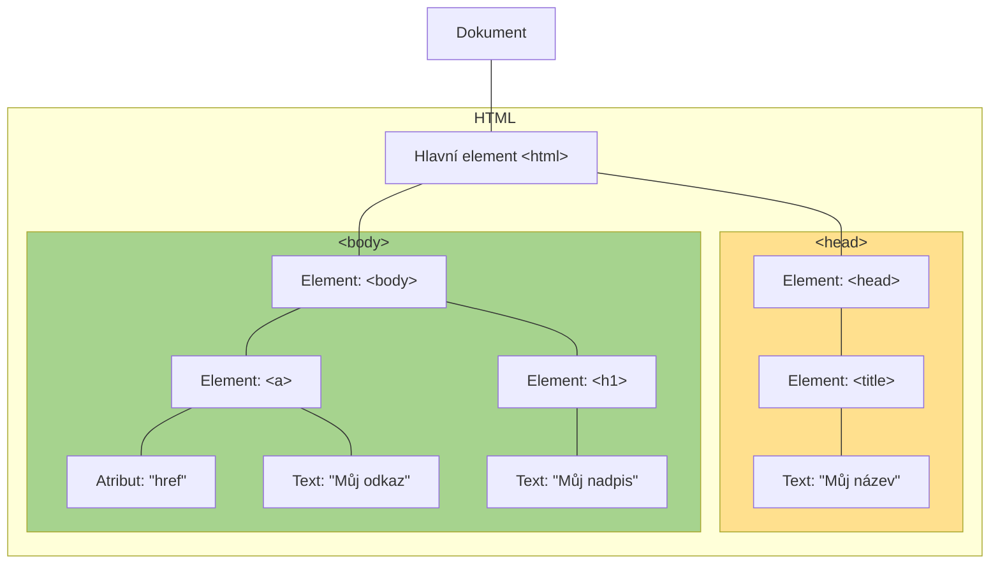

# 20. Frameworky pro webová řešení

> Bootstrap – filozofie, propojení s HTML a CSS, stylopisy, možnosti pro JavaScript. Příklady využití. JQuery – filozofie, použití, DOM, události, efekty, manipulace s CSS, jQuery jako plug-iny pro Bootstrap.

---

Webový framework je software určený k vývoji webových stránek a aplikací.

## Bootstrap

Bootstrap je webový framework používající CSS třídy a JavaScript pro responzivní webové stránky s hlavním zaměřením na
mobilní zařízení. Bootstrap je postavený na systému [Sass](https://sass-lang.com), sloužící ke tvorbě a správě CSS
stylů.

### Inicializace bootstrapu

Nejprve je potřeba v tagu `html` definovat jazyk stránky, pro češtinu:

```html
<html lang="cs">
```

Součástí `head` tagu je několik položek:

1. Definice, že stránka je formátovaná v utf-8
2. `meta` tag pro responzivní škálování layoutu
3. Odkaz na CSS soubor bootstrapu

```html
<meta charset="utf-8">
<meta name="viewport" content="width=device-width, initial-scale=1">

<link href="https://cdn.jsdelivr.net/npm/bootstrap@5.1.3/dist/css/bootstrap.min.css" rel="stylesheet" integrity="sha384-1BmE4kWBq78iYhFldvKuhfTAU6auU8tT94WrHftjDbrCEXSU1oBoqyl2QvZ6jIW3" crossorigin="anonymous">
```

A nakonec, do `body` tagu je potřeba vložit odkaz na Bootstrap JavaScript:

```html
<script src="https://cdn.jsdelivr.net/npm/bootstrap@5.1.3/dist/js/bootstrap.bundle.min.js" integrity="sha384-ka7Sk0Gln4gmtz2MlQnikT1wXgYsOg+OMhuP+IlRH9sENBO0LRn5q+8nbTov4+1p" crossorigin="anonymous"></script>
```

<details>
<summary><u>Startovní layout pro bootstrap</u></summary>

```html
<html lang="cs">
    <head>
        <meta charset="utf-8">
        <meta name="viewport" content="width=device-width, initial-scale=1">

        <link href="https://cdn.jsdelivr.net/npm/bootstrap@5.1.3/dist/css/bootstrap.min.css" rel="stylesheet" integrity="sha384-1BmE4kWBq78iYhFldvKuhfTAU6auU8tT94WrHftjDbrCEXSU1oBoqyl2QvZ6jIW3" crossorigin="anonymous">
    </head>

    <body>
        <script src="https://cdn.jsdelivr.net/npm/bootstrap@5.1.3/dist/js/bootstrap.bundle.min.js" integrity="sha384-ka7Sk0Gln4gmtz2MlQnikT1wXgYsOg+OMhuP+IlRH9sENBO0LRn5q+8nbTov4+1p" crossorigin="anonymous"></script>

        <!-- obsah stránky -->
    </body>
</html>
```

</details>

### Layout a rozložení stránky

Každá bootstrap stránka by měla být rozdělená do kontejnerů, kde každý z těchto kontejnerů tvoří mřížku elementů. Tato
mřížka má nadefinovaný počet řádků, určené pomocí `row` třídy a 12 sloupců, kde velikost sloupce je určena za
pomocí `col-x` třídy, kde x je velikost sloupce.

Nejprve je tedy třeba vytvořit kontejner, pak řádky a nakonec sloupce. Příklad takové mřížky:

*Poznámka: třída `border` slouží ke vložení ohraničení pro viditelnost*

```html
<div class="container-fluid">
    <div class="row">
        <div class="col-3 border">
            Sloupec, velikost 3
        </div>
        <div class="col-6 border">
            Sloupec, velikost 6
        </div>
    </div>
</div>
```

Ve výše uvedeném příkladu se nejprve inicializuje kontejner, poté řádek a nakonec 2 sloupce, první zabere 3/12 stránky a
druhý 6/12 stránky, což znamená, že 3/12 řádku zůstanou prázdné.

[Bootstap dokumentace](https://getbootstrap.com/docs/5.1/layout/grid/#setting-one-column-width) obsahuje spousty
příkladů ukazující funkci mřížky.

### Bootstrap prvky, komponenty a třídy

Veškeré prvky popisuje výše zmíněná dokumentace a není **asi** potřeba je umět úplně všechny.

#### Accordion

*Poznámka: následující sekce není nějak extrémně důležitá, je to jen ukázka funkčnosti bootstrapu*

Jedním z bootstrap prvků je [accordion](https://getbootstrap.com/docs/5.1/components/accordion/). Accordion je
rozbalovatelný prvek obsahující nějaké informace a tvoří se následovně:

```html
<div class="accordion" id="accordionExample">
    <div class="accordion-item">
        <h2 class="accordion-header" id="headingOne">
            <button class="accordion-button" type="button" data-bs-toggle="collapse" data-bs-target="#collapseOne" aria-expanded="true" aria-controls="collapseOne">
                Accordion Item #1
            </button>
        </h2>
        <div id="collapseOne" class="accordion-collapse collapse show" aria-labelledby="headingOne" data-bs-parent="#accordionExample">
            <div class="accordion-body">
                <strong>This is the first item's accordion body.</strong> It is shown by default, until the collapse plugin adds the appropriate classes that we use to style each element. These classes control the overall appearance, as well as the showing and hiding via CSS transitions. You can modify any of this with custom CSS or overriding our default variables. It's also worth noting that just about any HTML can go within the <code>.accordion-body</code>, though the transition does limit overflow.
            </div>
        </div>
    </div>
    <div class="accordion-item">
        <h2 class="accordion-header" id="headingTwo">
            <button class="accordion-button collapsed" type="button" data-bs-toggle="collapse" data-bs-target="#collapseTwo" aria-expanded="false" aria-controls="collapseTwo">
                Accordion Item #2
            </button>
        </h2>
        <div id="collapseTwo" class="accordion-collapse collapse" aria-labelledby="headingTwo" data-bs-parent="#accordionExample">
            <div class="accordion-body">
                <strong>This is the second item's accordion body.</strong> It is hidden by default, until the collapse plugin adds the appropriate classes that we use to style each element. These classes control the overall appearance, as well as the showing and hiding via CSS transitions. You can modify any of this with custom CSS or overriding our default variables. It's also worth noting that just about any HTML can go within the <code>.accordion-body</code>, though the transition does limit overflow.
            </div>
        </div>
    </div>
</div>
```

Třída `accordion` zabalí celý prvek a zaručí, že jen jeden accordion může být otevřený. Každá položka accordion je pak
označena za pomocí třídy `accordion-item` a nadpis každého accordion má třídu `accordion-header`. Součástí nadpisu je i
tlačítko, kterým se accordion rozbaluje a zabaluje, označené třídou `accordion-button`. Text accordionu je pak obalený
třídou `accordion-body`. Je potřeba mít stejné id názvy v accordionu pro správnou funkčnost (interně bootstrap používá
JavaScript a id pro funkci některých prvků, jako je accordion).

## DOM

Document Object Model. Lze o hierarchii HTML tagů tak, jak jdou za sebou. Zde je příklad kódu:

```html
<html>
<head>
    <title>Můj název</title>
</head>
<body>
    <a href="">Můj odkaz</a>
    <h1>Můj nadpis</h1>
</body>
```

Struktura DOM této stránky by vypadala následovně:



## jQuery

jQuery je JavaScript knihovna ulehčující výběr HTML elementů, animace, lepší použití Ajax, manipulaci s DOM, CSS a
další. Také garantuje lepší kompatibilitu mezi webovými prohlížeči než čistý JavaScript. Filozofií jQuery je mít více
zapouzdření v JavaScript kódu a také zamezení míchaní HTML a JS kódu.

### Inicializace jQuery

jQuery je nejprve nutné aktivovat na stránce přes oficiální [jQuery CDN](https://releases.jquery.com/) nebo
[přes Google](https://developers.google.com/speed/libraries#jquery). Příklad inicializace v `head` tagu:

```html
<script src="https://ajax.googleapis.com/ajax/libs/jquery/3.6.0/jquery.min.js"></script>
```

Všechen kód související s jQuery je potřeba vkládat do následujícího bloku:

```js
$(document).ready(function () {
    // vlastní kód nebo volání funkcí a tříd
})
```

To je z toho důvodu, že prohlížeč se může pokoušet spustit JS kód ještě před tím, než je načtena celá stránka, což může
způsobit neplatné fungování events a selektorů.

### Selektor

Selektory v jQuery využívají značku dolaru a poté závorku s uvozovkami a informacemi o selektoru.

| Selektor       | Popis                                           |
|----------------|-------------------------------------------------|
| `$("*")`       | Vybere všechny elementy                         |
| `$(this)`      | Vybere pouze současný element (třeba ve funkci) |
| `$("p")`       | Vybere všechny `p` elementy                     |
| `$("p.intro")` | Vybere všechny `p` elementy s třídou `intro`    |
| `$("[href])"`  | Vybere všechny elementy s atributem `href`      |
| `$("#tag")`    | Vybere všechny elementy s id `tag`              |

Více příkladů selektorů na [w3schools](https://www.w3schools.com/jquery/jquery_selectors.asp) a
v [jQuery docs](https://learn.jquery.com/using-jquery-core/selecting-elements/).

### Eventy

Následující kód, když umístěn do `<script>` tagu, vrátí alert při kliknutí na jakýkoliv element `p`:

```js
$("p").on("click", function () {
    alert("Bylo kliknuto na odstavec!")
})
```

Existuje spousta druhů events a z jejich jména je jasné, co dělají: `keyup`, `mouseover`, `click`, `focusout` atd.

```js
$("div").on("moseenter mouseleave", function () {
    console.log("Myš přišla na nebo opustila div element")
})
```

<details>
<summary>Příklad celé stránky implementující tento kód</summary>

```html
<html lang="cs">
<head>
    <title>jj</title>
</head>
<body>
<script src="https://code.jquery.com/jquery-3.6.0.min.js"></script>
<script>
    $(document).ready(function () {
        $("div").on("mouseenter mouseleave", function () {
            console.log("Myš přišla na nebo opustila div element")
        })
    })
</script>
<h1>čau jojo jj</h1>
<div>
    uvnitř div elementu
</div>
</body>
</html>
```

Při otevření konzole na této stránce uvidíme zprávy v konzoli když myš najede a odjede z textu v `div` elementu.
</details>

### Manipulace s CSS

Dělá se za pomocí property `.css` na selektoru. Jsou dva způsoby, jak nastavit in-line CSS, jeden za pomocí string a
druhý za pomocí objektu:

* `css("color", "blue")`
* `css({"color": "blue"})`

Pokud nespecifikujeme žádnou hodnotu, property vrátí hodnotu této CSS vlastnosti: `css("color")`. V případě prázdné
hodnoty proběhne její reset v in-line CSS.

Ukázková stránka ukazující všechny způsoby:

```html
<html lang="cs">
<head>
    <title>jj</title>
</head>
<body>
<script src="https://code.jquery.com/jquery-3.6.0.min.js"></script>
<script>
    $(document).ready(function () {
        const nadpis = $("h1")
        heading_color()
        
        $("#string").on("click", function () {
            nadpis.css("color", "darkturquoise")
        })

        $("#object").on("click", function () {
            nadpis.css({"color": "yellowgreen", "font-size": "5em"})
        })

        $("#reset").on("click", function () {
            nadpis.css({"color": "", "font-size": ""})
        })

        $("button").on("click", heading_color)

        function heading_color() {
            $("#heading-color").text(nadpis.css("color"))
        }
    })
</script>
<h1>čau jojo jj</h1>

<p>Barva nadpisu: <span id="heading-color"></span></p>

<button id="string">String</button>
<button id="object">Objekt</button>
<button id="reset">Reset CSS</button>
</body>
</html>
```

```
Autor: Roman Táborský
Datum: 8. 3. 2022
```