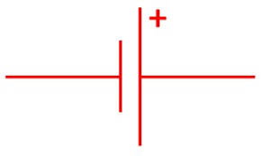
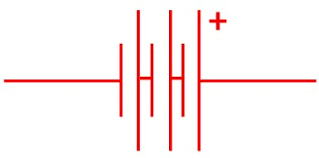
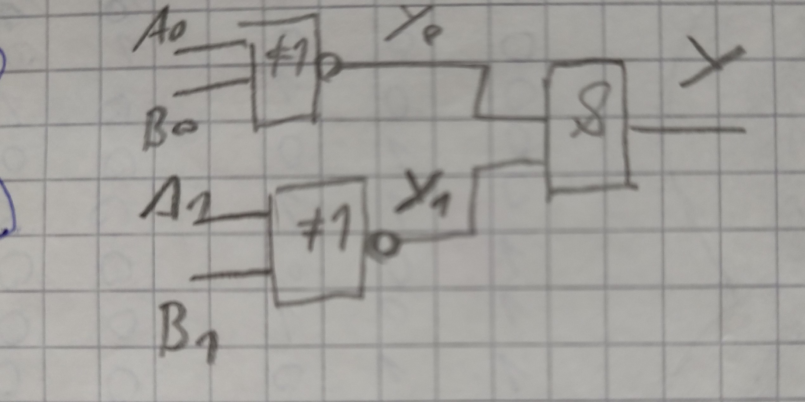
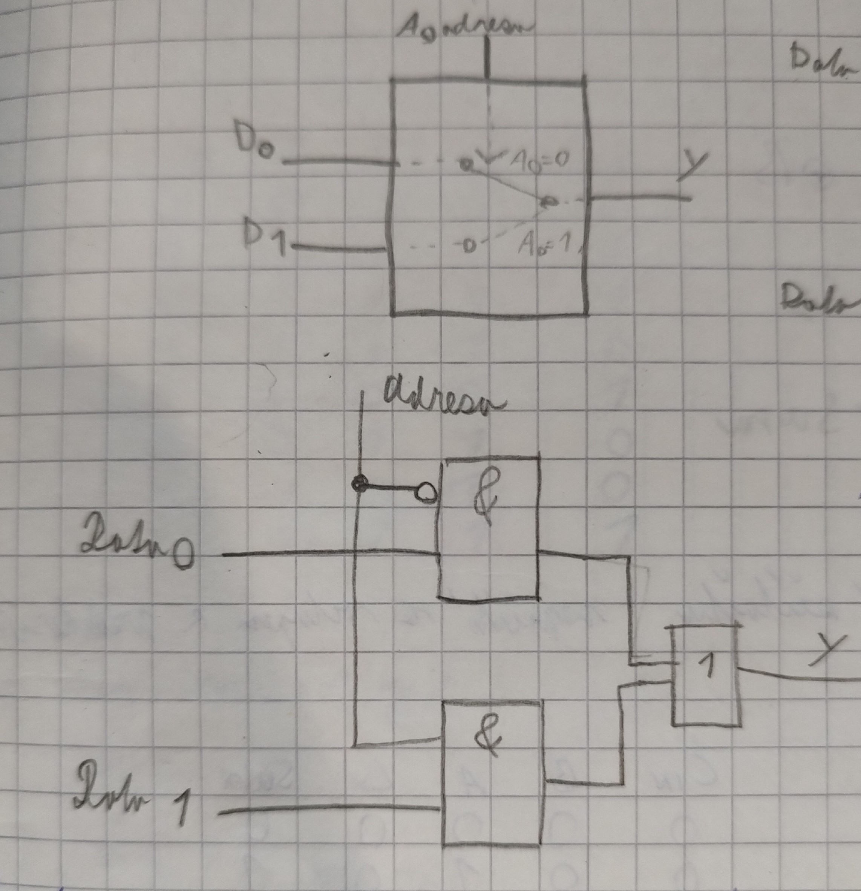
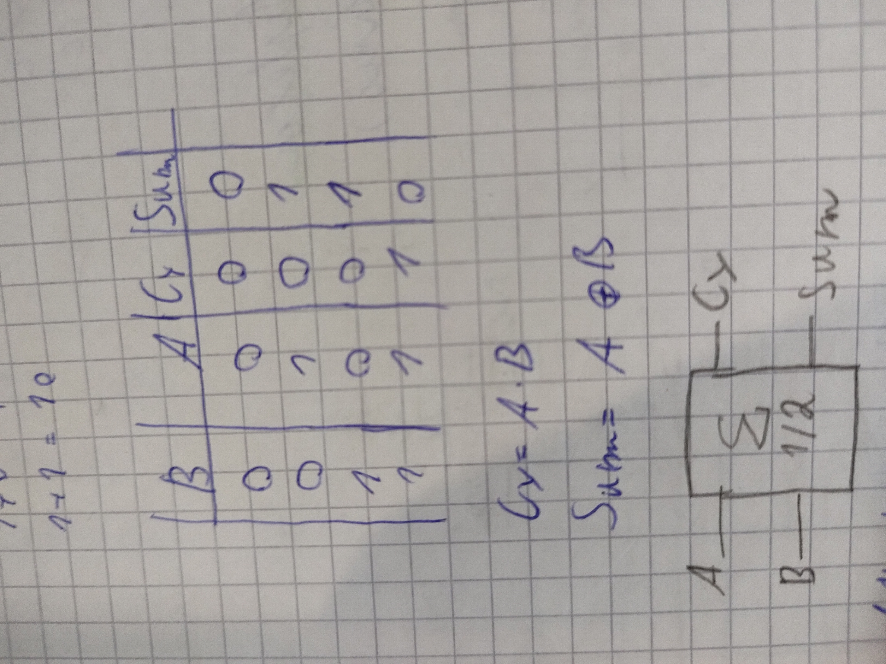
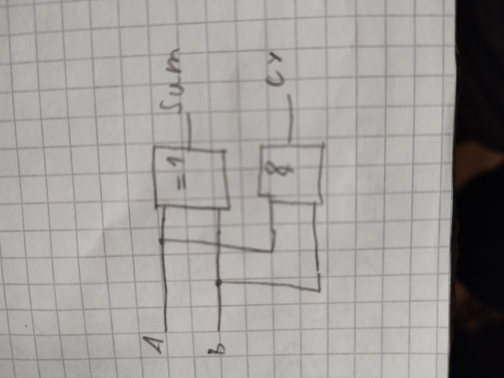
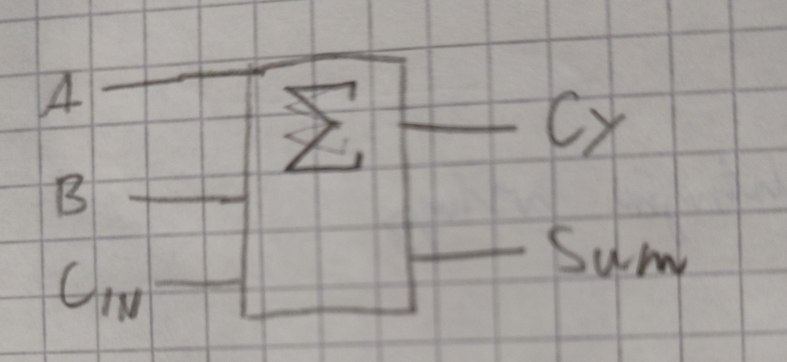
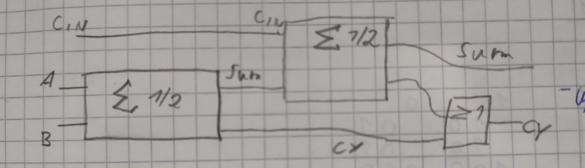

# Základy elektrotechniky a číslicové logiky

> Základní elektrické veličiny. Práce a výkon elektrického proudu. Sériové a paralelní zapojení rezistorů. Zdroje
> napětí. Základní logické funkce, logické úrovně, logické obvody. Typické kombinační obvody. Přehled kódů používaných v
> číslicové technice. Pull-up/pull-down na vstupech číslicových logických obvodů, připojení LED.

---

*Poznámka: Verze tohoto dokumentu je uzpůsobena pro budoucnost za předpokladu, že GitHub přidá podporu pro LaTeX. Do té
doby můžete buď použít druhou verzi dokumentu nebo si nainstalovat [xhub](https://chrome.google.com/webstore/detail/xhub/anidddebgkllnnnnjfkmjcaallemhjee).*

## Základní elektrické veličiny

### Elektrický náboj (Q)

Elektrický náboj je fyzikální veličina, která vyjadřuje velikost schopnosti působit elektrickou silou. Elementární náboj
je nejmenší možný elektrický náboj a je roven velikosti náboje elementárních částic elektronu (záporný náboj) a
protonu (kladný náboj).

Základní jednotkou je **Coulomb (C)** - množství elektrického náboje přeneseného proudem 1 A během 1 sekundy.

Velikost elementárního náboje $`e = 1.602 * 10 - 19 C`$

### Elektrický proud (I)

Elektrický proud je uspořádaný pohyb částic s elektrickým nábojem (proton, elektron). Jako fyzikální veličina je
elektrický
proud definován množstvím elektrického náboje Q prošlého vodičem za určitý čas t:

```math
I = \frac{Q}{t}
```

Základní jednotkou je **ampér (A)** - náboj o velikosti 1 C, který projde průřezem vodiče za 1 s.

Dohodnutý směr toku proudu je od kladného pólu k zápornému pólu zdroje, tento směr platí pro kladné náboje (protony),
pro záporné náboje (elektrony) je ve skutečnosti opačný.

Elektrický proud stejnosměrný (DC) protéká stále stejným směrem.

Elektrický proud střídavý (AC, symbol ∿) směr v čase mění.

### Elektrické napětí (U)

Elektrické napětí je práce potřebná při přemístění náboje o velikosti 1 C z místa A do místa B v elektrickém poli.
Elektrické napětí vzniká mezi tělesy, která jsou v rozdílném elektrickém stavu (mají rozdílný elektrický potenciál).
Základní jednotkou je **Volt (V)**.

(W - práce, Q - náboj)

```math
U = \frac{W}{Q}
```

### Elektrický odpor (R)

Elektrický odpor je fyzikální veličina charakterizující schopnost vodiče bránit průchodu elektrického proudu. Čím větší
odpor, tím hůře vodič vede proud. Závisí na materiálu, teplotě, délce a průřezu vodiče. Každý materiál má měrný
elektrický odpor &rho; (rezistivita), který nám popisuje, jaký odpor má krychle toho tohoto materiál o stranách metr
krát
metr. Základní jednotkou je Ohm (&Omega;).

Výpočet odporu vodiče (&rho; - rezistivita, L - délka vodiče, S - průřez vodiče):

```math
R = \rho * \frac{L}{S}
```

Opak elektrického odporu je vodivost se základní jednotkou Siemens (S). Vypočítá se jako převrácená hodnota elektrického
odporu.

```math
G = R^{-1}
```

### Ohmův zákon

Popisuje závislost mezi proudem, napětím a odporem v elektrickém obvodu.

```math
I = \frac{U}{R}
```

## Práce a výkon elektrického proudu

Elektrická práce u stejnosměrných obvodů je mírou přeměny elektrické energie na jiné druhy energie (
světelná, mechanická, …), neboli práce, kterou konají elektrické síly. Základní jednotkou je **Joule (J)**.

Práce se vykonává, přesuneme-li náboj Q mezi dvěma místy, mezi nimiž je napětí U.

```math
W = \frac{Q}{U}
```

Prochází-li vodičem, mezi jehož konci je napětí U, proud I po dobu t, vykoná elektrické pole práci

```math
W = U * I * t
```

Elektrický výkon je elektrická práce W vykonaná elektrickým proudem ve vodiči, mezi jehož konci je napětí U, za jednotku
času. Základní jednotkou je Watt (W)

```math
P = U * I
```

## Zapojení rezistorů

### Sériově


Zapojíme-li několik rezistorů za sebou, bude každým zapojeným rezistorem protékat stejný elektrický proud.

```math
I = I_1 = I_2 = I_3
```

Napětí, na jednotlivých rezistorech, se ale rozdělí.

```math
U = U_1 + U_2 + U_3
```

Celkový elektrický odpor sériově zapojených rezistorů se rovná součtu odporů jednotlivých rezistorů.

```math
R = R_1 + R_2 + R_3
```

### Paralelní


Napětí na každém ze třech paralelně zapojených rezistorů je přibližně stejné. Je rovno napětí zdroje.

```math
U = U_1 = U_2 = U_3
```

Celkový elektrický proud I se rozdělí podle velikosti odporu do jednotlivých rezistorů.

```math
I = I_1 + I_2 + I_3
```

Převrácená hodnota výsledného odporu se rovná součtu převrácených hodnot odporů jednotlivých rezistorů.

```math
\frac{1}{R} = \frac{1}{R_1} + \frac{1}{R_2} + \frac{1}{R_3}
```

## Zdroje napětí

Zdroj napětí je zdroj energie, který na svém výstupu udržuje stálé elektrické napětí bez ohledu na odebíraný elektrický
proud. Ideální zdroj napětí však neexistuje, neboť každý zdroj má svůj vnitřní odpor, který omezuje maximální proud. Čím
větší je vnitřní odpor zdroje, tím větší je úbytek napětí na zdroji při zatížení. Podle vnitřního odporu rozlišujeme
měkké zdroje (vnitřní odpor větší než 1 Ω) a tvrdé zdroje (vnitřní odpor menší než 1 Ω).

- Měnič napětí (adaptér, transformátor)
- chemické zdroje (galvanické články)
    - **Nenabíjecí** - voltův článek, salmiakový článek,lithiový článek, alkalický článek
    - **Nabíjecí** - Olověný akumulátor, alkalický akumulátor
- mechanické zdroje - generátory (dynamo pro stejnosměrný proud, alternátor pro střídavý proud)
- tepelné zdroje - termoelektrický článek,
- fotoelektrické zdroje - Fotovoltaický článek (sluneční článek),

**Schematické značky:**


Elektrický článek



Baterie elektrických článků



## Základní logické funkce

Logická funkce je funkce, která pro konečný počet vstupních parametrů vrací logické hodnoty.
Značky funkcí (vlevo americké značky, vpravo evropské - ty jsme se učili):


### NOT

Logická negace (invertor) – na výstupu je vždy opačná logická hodnota než na vstupu.

**Matematický zápis:** $`Y = \overline{A}`$ nebo $`Y = \neg A`$

**Pravdivostní tabulka:**

| A   | Y   |
|-----|-----|
| 0   | 1   |
| 1   | 0   |

### OR

Logický součet – má na výstupu log. 1 pouze tehdy, pokud je alespoň na jednom vstupu log. 1.

**Matematický zápis:** $`Y = A + B`$ nebo $`Y = A \land B`$

**Pravdivostní tabulka:**

| A   | B   | Y   |
|-----|-----|-----|
| 0   | 0   | 0   |
| 0   | 1   | 1   |
| 1   | 0   | 1   |
| 1   | 1   | 1   |

### AND

Logický součin – má na výstupu log. 1 pouze tehdy, je-li na všech jeho vstupech log. 1.

**Matematický zápis:** $`Y = A \cdot B`$ nebo $`Y = A \lor B`$

**Pravdivostní tabulka:**

| A   | B   | Y   |
|-----|-----|-----|
| 0   | 0   | 0   |
| 0   | 1   | 0   |
| 1   | 0   | 0   |
| 1   | 1   | 1   |

### NAND

Negovaný logický součin – má na výstupu log. 1 pouze tehdy, pokud není na všech vstupech log. 1. Je to negovaný (opačný)
výsledek logického součinu (AND).

**Matematický zápis:** $`Y = \overline{A \cdot B}`$

**Pravdivostní tabulka:**

| A   | B   | Y   |
|-----|-----|-----|
| 0   | 0   | 1   |
| 0   | 1   | 1   |
| 1   | 0   | 1   |
| 1   | 1   | 0   |

### NOR

Negovaný logický součet – má na výstupu log. 1 pouze tehdy, pokud je na všech vstupech log. 0. Je to negovaný (opačný)
výsledek logického součtu (OR).

**Matematický zápis:** $`Y = \overline{A + B}`$

**Pravdivostní tabulka:**

| A   | B   | Y   |
|-----|-----|-----|
| 0   | 0   | 1   |
| 0   | 1   | 0   |
| 1   | 0   | 0   |
| 1   | 1   | 0   |

### XOR

Exklusivní logický součet – má na výstupu log. 1 pouze tehdy, pokud je na vstupech rozdílná log. hodnota.

**Matematický zápis:** $`Y = A \oplus B`$

**Pravdivostní tabulka:**

| A   | B   | Y   |
|-----|-----|-----|
| 0   | 0   | 0   |
| 0   | 1   | 1   |
| 1   | 0   | 1   |
| 1   | 1   | 0   |

## Logická úroveň

Úroveň elektrického napětí, která určuje stav obvodu. Jelikož jsou informace vyjádřeny binárním číslem rozlišujeme dvě
napěťově úrovně - vysokou a nízkou. Nízká úroveň se obvykle blíží 0 voltům, vysoká může nabývat různých hodnot (
5V, 3.3V, 2.5V). Jestli stav logické 0 odpovídá nižšímu napětí na výstupu logického členu nežli stav logické 1, hovoříme
o
tzv. pozitivní logice. Je-li tomu naopak, tj. logické 0 odpovídá vyšší napětí nežli logické 1, pak se jedná o negativní
logiku.

## Logické obvody

Logický obvod je obvod, kde každá veličina na vstupu i na výstupu nabývá v ustáleném stavu jedné ze dvou hodnot (0, 1) a
který obsahuje takové prvky, u nichž vstupní i výstupní veličiny nabývají také jednu ze dvou hodnot. Logický obvod
obsahuje logické členy (hradla), které realizují logické funkce.

### Kombinační obvody

Kombinační logické obvody jsou takové logické obvody, ve kterých stavy na výstupech závisí pouze na okamžitých
kombinacích vstupních proměnných a nezávisí na jejich předchozích hodnotách.

#### Logický komparátor

Srovnává vstupní hodnoty a na výstupu udává jejich vztahy. Dělí se na jednoduchý (hodnoty jsou/nejsou stejné) a
magnitudový (hodnota A je/není větší než hodnota B)



##### Jednoduchý

**1b** - využívá funkci XNOR (negovaný XOR), pokud je hodnota A stejná jak B, objeví se na výstupu 1

| A   | B   | Y   |
|-----|-----|-----|
| 0   | 0   | 1   |
| 0   | 1   | 0   |
| 1   | 0   | 0   |
| 1   | 1   | 1   |

$`Y = \overline{A \oplus B}`$

**2b a více** - porovná každý bit dvou čísel zvlášť funkcí XNOR, výsledné hodnoty jsou poté zpracovány funkcí AND.
Pro A = 10 a B = 10:

| A0  | B0  | Y0  |
|-----|-----|-----|
| 0   | 0   | 1   |

| A1  | B1  | Y1  |
|-----|-----|-----|
| 1   | 1   | 1   |

| Y0  | Y1  | Y   |
|-----|-----|-----|
| 1   | 1   | 1   |

#### Generátor parity

Používá se pro detekci vzniku chyb v binárním kódu. Generator parity projde binární hodnotu a vygeneruje tzv. paritní
bit, který se poté používá pro kontrolu binárního kódu. Využívá funkci XOR.

**Sudá parita**
Je-li v binárním kódu sudý počet jedniček, pak je paritní bit 0.

| A   | B   | C   | P (sudá) |
|-----|-----|-----|----------|
| 0   | 0   | 0   | 0        |
| 0   | 0   | 1   | 1        |
| 0   | 1   | 0   | 1        |
| 0   | 1   | 1   | 0        |
| 1   | 0   | 0   | 1        |
| 1   | 0   | 1   | 0        |
| 1   | 1   | 0   | 0        |
| 1   | 1   | 1   | 1        |

$`P = A \oplus B \oplus C`$

#### Dekodér 1 z N

Dekodéry jsou kombinační logické obvody, které slouží ke zjištění (identifikaci) určitého kódu, binárního čísla nebo
převádějí vstupní kód na jiný. Tyto obvody mají opačnou funkci jako kodéry. 1 z N znamená, že v každém stavu má pouze
jeden výstup hodnotu 1.

**Např. Dekodér 1 z 4**

| A   | B   | Y0  | Y1  | Y2  | Y3  |
|-----|-----|-----|-----|-----|-----|
| 0   | 0   | 1   | 0   | 0   | 0   |
| 0   | 1   | 0   | 1   | 0   | 0   |
| 1   | 0   | 0   | 0   | 1   | 0   |
| 1   | 1   | 0   | 0   | 0   | 1   |

```math
Y_0 = \overline{A} \cdot \overline{B}\\

Y_1 = \overline{A} \cdot B\\

Y_2 = A \cdot \overline{B}\\

Y_3 = A \cdot B\\
```

#### Multiplexor (přepínač)

Podle adresy aktivuje jeden vstup a jeho hodnotu předá na výstup.



#### Binární sčítačka

Provádí aritmetickou operaci součtu dvou čísel.

##### Poloviční

Dva vstupy a dva výstupy, chybí ji vstup z předchozího řádu.




##### Úplná binární sčítačka

Má tři vstupy, dva pro sčítání a jeden pro přenos hodnoty z předchozího řádu.




## Přehled kódů používaných v číslicové technice

???

## Pull-up/pull-down na vstupech číslicových logických obvodů, připojení LED

Pull-up/pull down rezistor se používá na vstupech čislicových obvodů, aby na vstupu byla úroveň napětí pouze jako
logická 1 nebo 0. Pokud nepoužijeme Pull-up/Pull-down rezistor a necháme vstup "jen tak ve vzduchu", může dojít k
přeslechům hodnot kvůli elektromagnetickému rušení.

Pull down rezistor:


Pull up rezistor:


#### Připojení LED

Pro připojení led musíme nejprve dbát na polaritu (kde je + a kde -), negativní pól LED by měl "useklý"


LED dioda musí být připojena k zařízení přes rezistor, který chrání zařízení před odběrem vysokého proudu. Dále rezistor
sníží napětí ze zařízení (5V, 3.3V) na úroveň LED (červená - 1.8V, zelená - 2.2V...).


