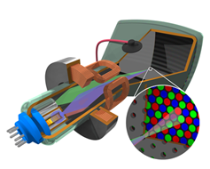
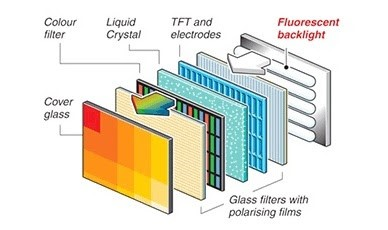
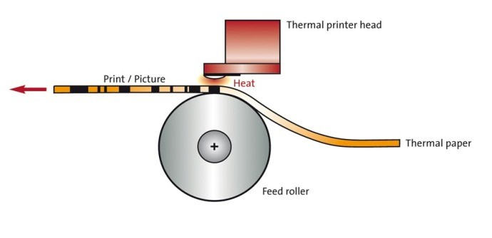
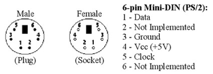
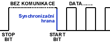
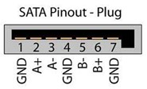

**Standartní periferní zařízeními**

**Klávesnice**

Periferní zařízení, které uživateli dovolí vkládat znaky do počítače. Jejich layout je převzatý z psacího stroje, avšak existují i efektivnější, jako je třeba DVORAK. Klávesnice měli spoustu konektorů např. DIN, PS/2, USB. Moderní klávesnice dělíme na membránové a mechanické.

**Mechanické**

Ke snímání stisku jsou využívány mechanické spínače. Tyto spínače pracují na principu mechanických částí.

**+ Životnost**

**+ Lepší hmatová odezva**

**+ Spolehlivost**

**Membránové**

Používají ke snímání stisku plošné obvody natištěné na plastových fóliích. Pokud stiskneme klávesu, dojde k prohnutí membrány a dotyku s kontaktní plochou, čímž se sepne obvod a klávesa zaznamená stisk.

**+ Cena**

**+ Jednoduchost výroby(dostupnost)**

**Myš**

Myš je periferní zařízení jenž pohybuje kursorem v grafickém prostředí. Bývá připojena skrze USB, či PS/2.

**Mechanická**

Snímá pohyb za pomoci kuličky která roztáčí dvě hřídelky, představující osy X a Y. Tato technologie je zastaralá a už se nepoužívá.

**Optická**

Podklad je osvětlen svítivou LED diodou a snímán miniaturní kamerou s nízkým rozlišením. Specializovaný mikroprocesor v myši vyhodnocuje posunutí obrazu a výslednou informaci předává do počítače.

**Monitory**

Monitory zobrazují výstup z PC. Signál je z počítače do monitoru přiváděn buď [analogově](https://cs.wikipedia.org/wiki/Analogov%C3%BD_sign%C3%A1l) ([VGA konektor](https://cs.wikipedia.org/wiki/VGA_(konektor))) nebo [digitálně](https://cs.wikipedia.org/wiki/Digit%C3%A1ln%C3%AD_data) ([DVI](https://cs.wikipedia.org/wiki/DVI_(konektor)), [DisplayPort](https://cs.wikipedia.org/wiki/DisplayPort), [HDMI](https://cs.wikipedia.org/wiki/HDMI). Jsou různé druhy, např. CRT, LCD, OLED, SED, Plazmová obrazovka, LED, atd…

**CRT (Cathode Ray Tube)**

funguje na principu katodové trubice (typ urychlovače elektronů) se stínítkem. Tato trubice je uzavřena do vakuové baňky. Obraz je vytvořen pomocí tří svazků urychlených elektronů, jeden pro každou barvu základního spektra RGB. Pro černobílé obrazovky stačí pouze jeden svazek. Svazky elektronů jsou vychylovány elektromagnetickými silami pomocí cívek. Elektrony dopadají na stínítko pokryté luminoforem.

**Lepší vysvětlení CRT (extrémně dobré video)**[https://youtu.be/Gnl1vuwjHto](https://youtu.be/Gnl1vuwjHto)

**+ Krátká odezva**

**+ Výborné zobrazení barev**

**+ Komfortní sledovací úhel**

**- Velké rozměry a váha**

**- Relativně velká spotřeba**

**- Citlivost na rušení magnetickým polem**

**LCD (Liquid Crystal Display)**

je zobrazovací panel, který funguje na principu tekutých krystalů. Tekutý krystal je látka, která dokáže setrvat jak v kapalném a pevném skupenství, tak vytvořit krystalickou strukturu. To vše je závislé na elektrickém náboji, který je krystalu dodáván. Tyto krystaly jsou vloženy mezi průhledné elektrody a polarizační filtry. Elektrickým nábojem je řízeno natočení těchto krystalů, a díky tomu dochází k řízení průchodu a polarizaci světla.

**Lepší vysvětlení LCD** [**https://www.youtube.com/watch?v=lZMnmtXY9JM**](https://www.youtube.com/watch?v=lZMnmtXY9JM)

**LED**

LED obrazovka je aktivní zobrazovací zařízení, jehož aktivním prvkem jsou světelné diody, takzvané LED (zkratka Light Emitting Diode), poskládané do sítě (matice) pokrývající celou plochu obrazovky. LED obrazovka je postavena na principu aditivního sčítání barev, kdy každý jednotlivý plnobarevný bod obrazovky tvoří trojice LED – červená, zelená a modrá. Při sledování velkoplošné LED obrazovky z určité vzdálenosti barevný svit všech tří LED splyne díky omezené rozlišovací schopnosti lidského oka a pozorovatel ho vnímá jako jeden barevný bod. Čím větší je rozteč mezi jednotlivými LED, tím větší je i minimální pozorovací vzdálenost.

**Tiskárny a princip tisku**

**Jehličková**

**Pomalá, hlučná tiskárna která tiskne přes inkoustový papírek. Velmi jednoduchá na údržbu a podporuje kopírovací papír. Využití na úřadech**

Jehličkové tiskárny fungují na podobném principu jako psací stroj. Na rozdíl od psacího stroje ale jehličkové tiskárny umožňují měnit druhy písma a do jisté míry také tisk jednoduché grafiky. Jednotlivé znaky jsou vykreslovány pomocí jehliček, které naráží do papíru přes barvicí pásku s inkoustem. Počet jehliček udává kvalitu tisku – čím více jich tiskárna má, tím je tisk kvalitnější. Existují tiskárny 2, 7, 9, 18, 24 nebo i více jehličkové. Obvykle se ale setkáte s jehličkovými tiskárnami s 9 nebo 24 jehličkami.

Tato technologie je výhodná především při tisku textových dokumentů, u kterých příliš nezáleží na kvalitě. Jehličková tiskárna se Vám bude hodit například při tisku dlouhých účetních sestav. Dodnes se s těmito tiskárnami běžně setkáte v bankomatech, pokladnách, prodejních terminálech nebo při označování jízdenek hromadné dopravy.Tato technologie také umožňuje při tisku vytvářet kopie pomocí „kopíráku&quot;, jelikož jehličky při tisku vytvářejí na papír tlak.

**Výhody:**

**+ Levný tisk**

**+ Dlouhá životnost**

**+ Spolehlivost**

**+ Možnost kopírování při tisku**

**Nevýhody:**

**- Pomalý tisk**

**- Hlučný tisk**

**- Nízká kvalita**

**- Nevhodná pro tisk obrázků**

**Inkoustová**

**Drahý inkoust, musí se dávat pozor aby nezaschla hlava. Mnohem kvalitnější a rychlejší tisk než jehličková. Spojení levného s rychlím.**

Obecně princip inkoustové tiskárny spočívá ve vystřelování mikroskopických kapek inkoustu z tiskové hlavy. Předtím než se tak stane, musí být tisková hlava díky speciální pumpě naplněná inkoustem ze zásobníků (cartridge).  Pak jsou barevné kapky inkoustu pomocí trysek pod tlakem vystřelovány na papír. V rámci inkoustového tisku existují **3 odlišné alternativy nanášení inkoustu**.

**Termický tisk** – Při tomto způsobu nanášení je inkoust ze zásobníku barev přivedený do trysek, uvnitř kterých jsou umístěny rezistory.Ty ohřejí tisk na vysokou teplotu, v důsledku čehož dojde zároveň ke zvýšení tlaku a inkoust je následně tryskami vystřelovaný napapír. Chemické procesy se pak postarají o fixaci inkoustu.

**Piezoelektrický tisk** – podobně jako termický, při nanášení inkoustu využívá k vystřelování kapek vytvořený tlak. Rozdíl je však v tom,že tlak v tomto případě není důsledkem vysoké teploty, ale vzniká působením elektrického proudu na piezoelektrický prvek. Ten se„deformuje&quot; a vytvořený tlak vystřeluje inkoust na papír. Inteligentní řídící jednotka tiskárny zároveň optimalizuje tvarvystřelovaných kapek tak, aby bylo dosaženo co nejvyšší kvality tisku.

**Voskový tisk** - Inkoust má voskovou konzistenci, která se nahřáním rozpustí a namíchá do požadovaného odstínu v tiskové hlavě. Po namíchání příslušného odstínu je inkoust stejně tak jako při piezoelektrickém tisku vystřelovaný pod tlakem. Tentokrát ovšem ne přímo na papír, ale nejprve na válec podobně jako je tomu při laserovému tisku. Po otisknutí papíru na válec ovšem na rozdíl od laserového tisku nedochází k zapékání inkoustu.

**Výhody:**

**+ Pořizovací ceny**

**+ Malé rozměry**

**+ Vysoká kvalita tisku**

**Nevýhody:**

**- Vhodná pouze pro malý a střední objem tisku**

**- Inkoust není voděodolný**

**- Riziko vysychání inkoustu**

**Laserová**

**Tisk za pomocí toneru. Velmi kvalitní tisk a velmi rychlý. Tonery a samotné tiskárny jsou však dražší.**

Selenový fotoválec, který je vodivý, reaguje na osvit a mění svůj elektrický odpor. Konstantně se otáčející válec je nabitý po celém svém povrchu statickým nábojem.  Prostřednictvím optické soustavy a laseru se na něj vypálí požadovaný obraz. V místech, kde byl fotoválec zasažený laserovým paprskem, ztratí válec náboj a při styku s tonerem se následně obarví pouze na těch místech, která byla laserem zasažena. Při dalším pohybu fotoválce se prášková barva přenese na [papír](https://www.originalnitonery.cz/papiry-a-fotopapiry). Ten dříve než opustí tiskárnu, projde ještě zažehlovacím válcem, který na něj prášek vypálí při teplotě kolem 200 °C. Tímto způsobem je docíleno toho, že prášková barva na papír dokonale přilne.Dalším principem vypalování laserovou tiskárnou na papír je:

**Technologie LED –** přitechnologii LED je laserový paprsek nahrazen řadou LED diod a otáčející se válec je osvětlován po řádcích. Jedná se o konstrukčně jednodušší řešení, nicméně na úkor horší kvality tisku. Princip fungování je velmi podobný laserové technologii.

**Výhody:**

**+ Vysoká rychlost a kvalita tisku**

**+ Nízká hlučnost**

**+ Nízké provozní náklady**

**Nevýhody:**

**- Vyšší pořizovací náklady**

**- Větší rozměry a váha**

**- Potřebuje čas na zahřátí**

**- Při tisku vzniká ozon (nebezpečné v uzavřeném prostoru)**

**Termální**

Jehličky, které se zahřívají fotocitlivý papír.

**Výhody:**

**+ Konstrukční jednoduchost**

**+ Malé rozměry**

**+ Cena**

**Nevýhody:**

**- Nestálost v čase**

**Rozhraní pro připojení periferních zařízení**

**PS/2**

Konektor PS/2 je šestikolíkový konektoru typu mini-DIN. Díky tomuto konektoru (většinou ze zadní strany PC) se k PC připojuje klávesnice, polohovací zařízení (myš, trackball a jiné) anebo další speciální periferie.

Pro připojení klávesnice slouží konektor fialový nebo barevně půlený. Pro připojení myši pak zelený anebo opět půlený. Konektory nejsou nijak mechanicky odlišeny. Pokud ale zapojíte klávesnici do konektoru pro myš a opačně, zařízení se sice nic nestane, ale nebude fungovat.

**PS/2 je dnes již plně nahrazeno portem USB.**

**Sériový port RS-232**

RS232 je rozhraní pro přenos informací vytvořené původně pro komunikaci dvou zařízení do vzdálenosti 20 m. Pro větší odolnost proti rušení je informace po propojovacích vodičích přenášena větším napětím, než je standardních 5 V. Přenos informací probíhá asynchronně, pomocí pevně nastavené přenosové rychlosti a synchronizace sestupnou hranou startovacího impulsu.

bity přenášených dat jsou vysílány postupně za sebou (v sérii) po jednom páru vodičů v každém směru. Na rozdíl od síťové technologie Ethernet nebo rozhraní USB se tedy jedná o zcela bezkolizní fyzickou vrstvu.

RS232 Používá asynchronní přenos informací. Každý přenesený byte konstantní rychlostí je proto třeba synchronizovat. K synchronizaci se používá sestupná hrana tzv. Start bitu. Za ní již následují posílaná data.

**Lepší vysvětlení RS-232** [**https://www.youtube.com/watch?v=eo9dbnrpspM**](https://www.youtube.com/watch?v=eo9dbnrpspM%20)

**Universal Serial Bus**

Plug and play, možnost napájení

[**https://www.youtube.com/watch?v=pIZREjck9jg**](https://www.youtube.com/watch?v=pIZREjck9jg)

**USB 1.0**

Ve verzi USB 1.1 existují pomalá (Low-Speed) zařízení s přenosovou rychlostí 1,5 Mbit/s (187,5 kB/s) a rychlá zařízení (Full-Speed) s rychlostí 12 Mbit/s (1,5 MB/s). USB 1.1 však nebylo schopno konkurovat vysokorychlostním rozhraním, např. FireWire (IEEE 1394) od firmy Apple (400 Mbit/s; až 63 zařízení).

**USB 2.0**

Nabídlo maximální rychlost 480 Mbit/s (60 MB/s) v režimu Hi-Speed, avšak zachovalo zpětnou kompatibilitu s USB 1.1 (režimy Low-Speed a Full-Speed).

**USB 3.0**

USB 3.1 disponuje více než desetinásobnou rychlostí, přenosová rychlost je 5 Gbit/s (671 MB/s). Nová technologie má 9 vodičů namísto původních 4 (datové vodiče jsou již 4), přesto zpětně podporuje USB 2.0. Díky tomu je možné používat libovolnou kombinaci zařízení a portů USB 2.0 a USB 3.1.

**USB 3.1 gen2**

Verze 3.1, též pod názvem USB SuperSpeed+ 3.1, byla představena 31. července 2013. Hlavní avizovanou vlastností byla zpětná kompatibilita a plánovaná rychlost 10 Gbit/s (1.25 GB/s).

**USB 4**

Vydáno v roce 2019. Rychlost 40 Gb/s (5 GB/s)

**USB-C**

USB-C byl 3. prosince 2013 představen jako konkrétní návrh standardu[[1]](https://cs.wikipedia.org/wiki/USB-C#cite_note-usb_press_release-1) a konektoru (nazývaného typ C). Ten se rozměry blíží variantě microUSB, svými vlastnostmi [konektoru Lightning](https://cs.wikipedia.org/wiki/Lightning_(konektor)) od [Applu](https://cs.wikipedia.org/wiki/Apple). USB-C se dá oproti svému předchůdci zasunout oběma směry, i vzhůru nohama, a stále bude fungovat.

USB typu C má na obou stranách stejný konektor skládající se z 24 kontaktů (12 shora, 12 zespoda).

Tento konektor disponuje nejen datovou prostupností 10 Gb/s, ale může být použit i k napájení zařízení. Maximum je 5 A při 20 V, tedy 100 W (v porovnání se starší verzí je to až 40x více), což dostačuje i pro napájení většiny notebooků.

**Firewire**

FireWire (označované jako i.Link nebo IEEE 1394) je standardní sériová sběrnice pro připojení periférií k počítači. Díky své technické jednoduchosti a pořizovací ceně nahrazuje dříve používané způsoby připojení, především SCSI.

S označením FireWire pro svou sběrnici IEEE 1394 přišla už v 90. letech společnost [Apple](https://www.alza.cz/apple/v1627.htm). Za zhruba 15 let vývoje si pak FireWire prošel celou řadou vylepšení.

- **FireWire 400 (IEEE 1394, později IEEE 1394a)** byl úplně první standard. Konektor měl 4 piny, s napájením 6 pinů a dosahoval rychlosti přenosu až 400 Mbit/s.
- **FireWire 800 (IEEE 1394b)** nabízel až dvojnásobnou rychlost. Konektor byl 9pinový a přenosová rychlost se pohybovala okolo 800 Mbit/s.
- **FireWire S1600 a S3200**  byly standardy zamýšlené jako vylepšení pro IEEE 1394b. Ve vývoji však šlo o slepou uličku, a tak tyto konektory měla jen hrstka zařízení.
- **FireWire S800T (IEEE 1394c)** byl posledním vydaným standardem FireWire. Konektor byl kompatibilní s dnešním Ethernet portem, k široké veřejnosti se už ale téměř nedostal.

**Dnes je FireWire kompletně nahrazen. (Lightning a USB)**

**Disková rozhraní**

**ATA (Advanced Technology Attachment****)**

- Jedná se o paralelní rozhraní
- První verze podporovala disky do 528MB
- 40 žílový kabel
- Připojení max 2 zařízení na jeden kabel

- Rychlost přenosu se odvíjí od typu rozhraní

**ATA bylo kompletně nahrazeno (SATA)**

**SATA (Seriál ATA)**

- Sériový přenos
- Několik verzí
  - V1 = 1,5 Ghz  1,5 Gbit/s
  - V2 = 3 Ghz  3 Gbit/s
  - V3 = 6 Ghz  6 Gbit/s
- Fullduplex (Data lze přenášet oběma směry současně)
- Kabel má 7 vodičů

**Zobrazovací soustavy**

**CMYK**

- Azurová (Cyan)
- Purpurová (Magenta)
- Žlutá (Yellow)
- Černá (Black)

**Používá se především u reprodukčních zařízení, která barvy tvoří mícháním pigmentů (např. inkoustová tiskárna).**

**RGB**

- Červená (Red)
- Zelená (Green)
- Modrá (Blue)

**Používá se v barevných [monitorech](https://cs.wikipedia.org/wiki/Monitor_(obrazovka)) a [projektorech](https://cs.wikipedia.org/wiki/Dataprojektor) (jde o míchání vyzařovaného světla)**