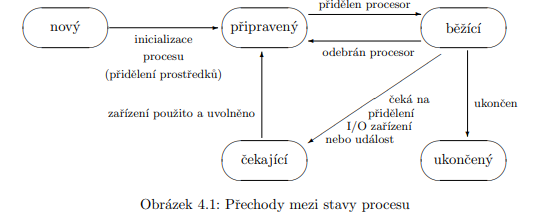
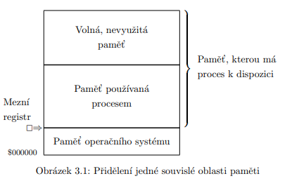
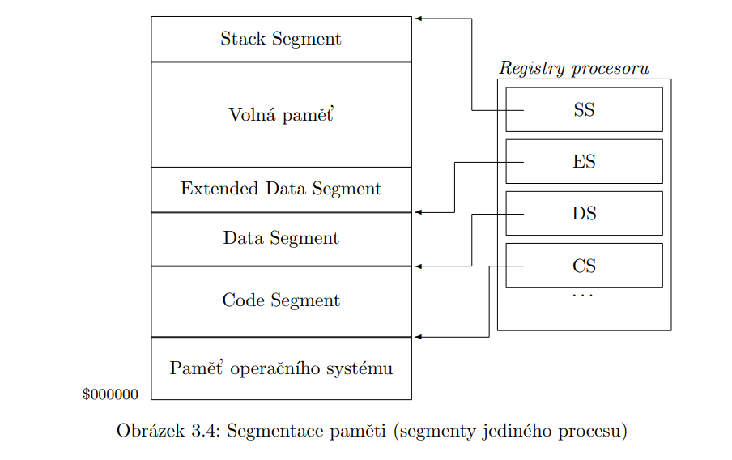
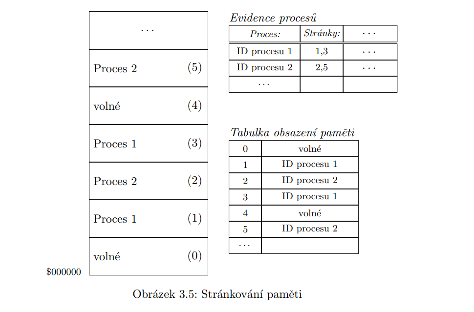
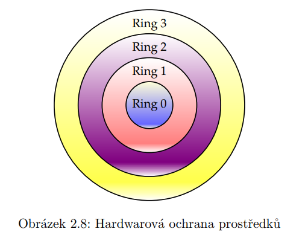

# 6. Správa procesů a paměti

> Typologie a charakteristika OS, evidence procesů, správa procesů, správce paměti, reálné metody přidělování
paměti, virtuální paměť, defragmentace, segmentace, stránkování, ring 0-3, swapování, endianita.

## Primární funkce operačních systémů
- správa paměti, procesů, periferií, systému, souborů, uživatelů, úloh
- uživatelské rozhraní
- programové rozhraní (API)


## Rozdělení OS

- dle počtu ovládaných procesorů:
    - jednoprocesorové
    - víceprocesorové
- dle počtu spravovaných uživatelů:
    - jednouživatelské
    - více uživatelské
- dle počtu spuštěných programů (úloh):
    - jednoprogramové
    - víceprogramové (s multitaskingem)
- dle míry specializace:
    - speciální
    - univerzální
- speciální kategorie:
    - operační systémy reálného času (RTOS)
        - vyznačují se nízkou reakční dobou, jsou schopny reagovat téměř   okamžitě na události v reálném čase
        - používají se zejména v náročných aplikacích - elektrárny, letecký provoz
        - příklady: RT Linux, QNX, nadstavba IntervalZero RTX, VxWorks
    - distribuované operační systémy
        - operační systém schopný pracovat na více uzlech spojených počítačovou sítí

## Evidence procesů


Procesem se rozumí instance programu - již spuštěný a běžící program, se kterým se pojí jeho stav (běhový stav, ID, prostředky, kontext, ...).

Proces může mít tyto stavy:
- nový (new) – vytvořen, čeká na počáteční alokaci prostředků
- připravený (ready) - čeká se na změnu kontextu a spuštění procesu
- běžící (running) – proces byl naplánován na konkrétní procesor a běží
- čekající (waiting) – čeká na I/O prostředek či událost
- ukončený (terminated) – běh procesu byl ukončen

V rámci některých OS mohou byt definovány i další stavy. Např. v UNIXových systémech může být proces navíc v jednom z těchto stavu:
- pozastaven – provádění programu je pozastaveno (to se provádí signálem SIGTRAP), 
  obvykle požadavkem debuggeru, typicky při ladění programu,
- zombie – program byl v podstatě ukončen, užř nemí žádný kód k provádění a nedostává procesor, 
  ale jeho prostředky (vč. PID) ještě nebyly uvolněny, to se používá např. tehdy, když si rodič tohoto procesu explicitně 
  vyžádal tento typ ukončení, aby měl dost času na vyzvednutí výsledku činnosti tohoto svého potomka.
- uspaný (sleeping) – proces čeká na splnění podmínky např. uplynutí časového intervalu nebo nějakou událost.

## Správa procesů

Kontext procesu je souhrn břehových informací o procesu. Při různých typech multitaskingu zde řadíme různé informace, obvykle jsou součástí kontextu hodnoty registrů procesoru.

Procesy se evidují pomocí struktury zvané Process Control Block (PCB), která mj. obsahuje tyto položky:
- ID procesu
- stav procesu
- ukazatele do front
- informace správy paměti
- seznam přidělených prostředků (soubory, zařízení, ...)

Procesy mohou běžet několika způsoby:
- sekvenčně – další proces může byt spuštěn až po ukončení činnosti předchozího,
- sekvenčně-paralelně – je spuštěno více procesů, které se dělí o čas procesoru (například se v 
  určitých intervalech střídají při jeho využívání)
- paralelně – procesy pracují souběžně, každý může běžet na jiném procesoru multiprocesorový ⇒ systém s multitaskingem. 
  Pokud máme víceprocesorový systém nebo systém s jedním vícejádrovým procesorem, mohou procesy běžet paralelně (třetí způsob),
  pričemž se uplatňuje i sekvenčně-paralelní běh, protože často máme víc spuštěných procesů než jader procesoru. 
  Když se procesy střídají na jednom procesoru (k tomu může dojít v druhem nebo třetím případě), dochází k přepínání kontextu, 
  tedy změně běhových informací o procesu uložených na "globálních místech" (například registry procesoru), 
  proto je nutné kontext dosud běžícího procesu příklad každém přepnutí uložit, například do PCB (tedy tabulky procesu) 
  nebo do paměťového prostoru příslušného procesu – do jeho zásobníku. 
  Při přepínání kontextu se uloží kontext původně běžícího procesu a obnoví kontext následujícího procesu.

## Správa paměti

Modul správce paměti je v operačních systémech většinou součástí jádra. Jeho implementace může být
různá, ale funkce jsou obvykle podobné:

- udržuje informace o paměti (která část je volná, která část je přidělena, kterému procesu je 
  přidělena, atd.).
- přiděluje paměť procesům na jejich žádost.
- paměť, kterou procesy uvolní, zařazuje k volné paměti.
- pokud je to nutné, odebrat paměť procesům.
- jestliže je možné detekovat případy, kdy proces ukončí svou činnost bez uvolení paměti (například 
  při chybě v programu nebo při násilném ukončení), pak modul tuto paměť uvolní sám.
- pokud to dovoluje úroveň hardwarového vybavení (především procesor), může zajišťovat ochranu paměti, 
  tedy nedovolí procesu přístup do paměťového prostoru jiného procesu nebo dokonce do paměťového 
  prostoru operačního systému.


## Reálné metody přidělování paměti

Používají se v případech, kdy logický adresní prostor nepřekračuje fyzický adresní prostor
- přidělení jedné souvislé oblasti paměti – spočívá v přidělení veškerého adresového prostoru kromě oblasti OS
    - výhody: jednoduchost
    - nevýhody: nemožnost míst spuštěno více programů
- přidělování bloků pevné velikosti
    - výhody: jednoduchost, možnost multitaskingu
    - nevýhody: proces vyžadující více paměti, než je délka největšího volného bloku nelze spustit
- dynamické přidělování bloků paměti
    - výhody: částečně odstraňuje nevýhody předchozí metody
    - nevýhody: pravděpodobnost fragmentace, počet spustitelných procesů je limitován požadavky již 
      spuštěných procesů
- Segmentace – každému procesu je přiřazeno několik různě dlouhých bloků paměti (segmentů) 
    - výhody: velikost segmentů může být různá, segmenty lze prodlužovat a přesouvat
    - nevýhody: nutnost HW podpory, komplikovanější ochrana paměti
- jednoduché stránkování – pracuje s fyz. a log. adresou objektu v paměti, paměťový prostor je rozdělen 
  na stejně dlouhé úseky a procesu je přiděleno tolik úseků, kolik potřebuje 
    - výhody: nejsou problémy s fragmentací
    - nevýhody: omezení daná velikostí fyz. adresového prostoru

## Přidělení jedné souvislé oblasti paměti

Tato jednoduchá metoda spočívá v přidělení veškerého adresového prostoru procesu kromě oblasti
operačního systému. Pamět’ je rozdělena na tři části: pamět’ vyhrazenou pro operační systém, pamět’
využívanou procesem a nevyužitou pamět’. Pro ochranu paměti je vhodné alespoň používat mezní
registr, ve kterém je uložena adresa začátku paměti procesu (tedy odděluje pamět’ operačního systému
od paměti procesu), tento registr pak proces nesmí překročit. Pokud proces (vlákno) žádá o přístup k
určité adrese, porovnáme tuto adresu s registrem, a jestli je adresa větší, přístup povolíme.



Výhody:

- jednoduchost správy,
- nevelké nároky na technické vybavení (funguje to prakticky všude). Nevýhody:
- nemožnost mít spuštěno více procesů najednou (jednoprogramový systém),
- velká část paměti může zůstat nevyužitá, pokud ji jeden běžící proces nepotřebuje, také ostatní
prostředky výpočetního systému jsou nedostatečně využívány (procesor). S mírným zvýšením složitosti
lze i v tomto případě používat omezený běh více procesů (víceprogramový systém, ale ne
multitaskový), a to tak, že když má být spuštěn další proces, celá pamět’ od mezního registru (přidělená


původnímu procesu) se uloží do dočasného souboru na pevný disk, pak je přidělena nově spuštěnému
procesu a až po jeho ukončení je obnovena do stavu před ” zálohováním“ při spouštění dalšího procesu.
Jestliže je takto postupně spuštěno více procesů, může být pro organizaci odložených procesů použit
princip zásobníku. Tuto metodu používaly operační systémy, které nebyly multitaskové (například CP/
M), případně ji můžeme použít při programování složitější aplikace, kde chceme rozdělit vlastní
adresový prostor (třeba mezi více vláken).

## Virtuální paměť

Virtuální pamět’ je koncept, kdy oblast vnitřní paměti rozšíříme o oblast na vnějším pamět’ovém
médiu, obvykle pevném disku. Pro procesy je tento koncept naprosto transparentní (naprosto stejným
způsobem se z pohledu procesu zachází se všemi adresami v paměti, at’ už se fyzicky nacházejí
kdekoliv), proto hovoříme o virtualizaci paměti. Adresní prostor, který ” vidí“ procesy, se nazývá
logická pamět’. Důvodem virtualizace paměti je odstranění základní nevýhody všech reálných metod
přidělování paměti, nemožnosti spustit proces, jehož požadavky na pamět’ jsou vyšší než množství
momentálně volné (fyzické) operační paměti. Existuje více metod pro práci s virtuální pamětí, obvykle
vycházejí z reálné metody stránkování (případně v kombinaci s jinou metodou).

## Segmentace

Každému procesu je přiřazeno několik (různě dlouhých) bloků paměti, segmentů. Pokud je to potřeba a
je v daném směru volná oblast paměti, segmenty lze prodlužovat. Každý segment obvykle mívá určitý
účel, například segment pro kód procesu (code segment), datový segment (data segment, pro globální
konstanty a proměnné), zásobníkový segment (stack segment, obsazuje se od nejvyšších adres k
nejnižším, pro lokální proměnné a reálné parametry funkcí), překryvný segment (overlay segment,
například pro dynamické knihovny). Konkrétní rozvržení typů segmentů záleží na daném operačním
systému. Některé segmenty jsou plně konstantní (nemění se jejich délka ani obsah, například segment
pro kód procesu), jiné mají konstantní délku, ale proměnný obsah (globální proměnné), další mají
proměnnou délku i obsah (zásobník). To lze zohlednit při umíst’ování segmentů v paměti a řešení
fragmentace. Pokud má segment proměnnou délku (např. zásobník), umíst’uje se tak, aby při
případném přetečení (posunu hranice až tam, kde nemá co dělat) narušil spíše pamět’ový prostor
vlastního procesu než pamět’ový prostor cizího procesu (tj. měl by růst směrem k ostatním segmentům
daného procesu). Procesy, které jsou instancemi téhož programu, mohou sdílet plně konstantní
segmenty (pokud to systém umožňuje). Segment je tedy pamět’ový blok určený pro jeden konkrétní
účel, jehož délka je danému účelu přizpůsobena. Procesy používají relativní adresy, adresy začátku
jednotlivých segmentů jsou uloženy v segmentových registrech procesoru (tedy je to opět hardwarově
závislé řešení, každý procesor má jiné adresové/segmentové registry). Absolutní adresa je pak
vypočtena pomocí obsahu segmentových registrů. Adresa objektu z hlediska procesu má tedy dvě části

- segment (určení, ve kterém segmentu se objekt nachází) a offset (relativní adresa v rámci segmentu,
první Byte v segmentu má offset = 0). Výhodou tohoto řešení je, že případné přesouvání segmentu


nezpůsobí procesu problémy s adresami. Je nutné zajišt’ovat mapování relativní adresy v segmentu na
absolutní adresu. Pokud je implementován multitasking, je nutné při ” výměně“ procesů na procesoru
uložit obsah segmentových registrů odstavovaného procesoru a při znovupřidělení procesoru tomuto
procesu znovu tyto hodnoty do registrů načíst.

Výhody:

- velikost segmentů může být různá, podle potřeby procesu,
- segmenty je možné prodlužovat a přesouvat,
- pokud to správce paměti umožní, některé segmenty lze sdílet.

Nevýhody:

- nutnost hardwarové podpory (segmentové registry),
- ochrana paměti je komplikovanější, protože segmenty mají proměnnou délku,
- pamět’, kterou lze dalšímu procesu přidělit, je omezena velikostí největšího souvislého bloku volné
paměti,
- určitá pravděpodobnost fragmentace, ta se ale dá řešit přesouváním segmentů.



## Defragmentace

Fragmentace na vnějším pamět’ovém médiu vzniká tehdy, když smažeme jeden soubor, do takto
uvolněného místa je uložen nový soubor, ten se rozhodneme prodloužit a on se po tomto prodloužení
do tohoto místa nevejde, tedy je nutné na konci volného místa vytvořit odkaz (at’ už jakkoliv) na další
volné místo, ve kterém soubor pokračuje. Aby byla pamět’ fragmentovaná, ale stačí i mnohem méně –
pokud je při ukládání souboru vybíráno zbytečně velké místo. U operační paměti je situace podobná,
jen místo souborů pracujeme s pamět’ovými prostory jednotlivých procesů. Pamět’ové prostory
procesů obvykle nebývají rozdrobeny na více částí, ale přesto k fragmentaci dochází. V případě, že o
pamět’ žádá nově spouštěný proces, musí být procházena pamět’ a hledán vhodně velký volný blok
paměti, a v případě, že není nalezen dostatečně velký blok, proces nelze spustit. Fragmentace se u
reálných metod přidělování paměti dá snížit dvěma způsoby – vhodnou metodou výběru bloku paměti
při žádosti procesu (alokační strategie) nebo setřásáním paměti. Když nově spouštěný proces požádá o
pamět’, stejným způsobem také hledáme vhodně velký volný blok. Základním předpokladem je, aby se
do nalezeného bloku požadavek procesu vešel, což nám může dát více možností výběru bloku:

- metoda first fit – správce paměti prochází bloky od začátku uživatelské oblasti a přidělí pamět’ z
prvního vhodného bloku, je to nejrychlejší metoda, i když ne nejoptimálnější (větší pravděpodobnost
fragmentace),
- metoda best fit – správce paměti projde všechny bloky a hledá takový blok, který je vhodný
(požadavek se do něho vejde) a zároveň je co nejmenší, je to nejoptimálnější metoda (je co nejmenší ”
zbytek“), ale časově náročnější než ta předchozí,
- metoda last fit – správce paměti vyhledá poslední vyhovující, tuto metodu použijeme, pokud pamět’
má být obsazována směrem od nejvyšších adres k nejnižším (práce s pamětí typu zásobník). Pokud
pouze volíme vhodnou metodu výběru bloku paměti, řešíme fragmentaci jen částečně. Společnou
výhodou těchto metod je, na rozdíl od následujícího řešení, že adresový prostor procesu se po celou
dobu jeho běhu nemění.

## Stránkování

Metoda stránkování rozlišuje fyzickou adresu objektu v paměti (to je absolutní adresa objektu) a
logickou adresu tohoto objektu (s tou pracují procesy). Pamět’ový prostor je rozdělen na stejně dlouhé
́useky – stránky, pokud možno spíše menší velikosti (obvykle čtyři KiB), procesu je přiděleno tolik
́useků, kolik potřebuje. Velikost stránky by měla být mocninou čísla 2 (typicky 1024 B, 2048 B,
nejčastěji 4096 B = 4 KiB, ale mohou být i v jednotkách MB), aby bylo možné provádět rychlé operace
s adresami pomocí bitových posunů. Procesu se jeho adresový prostor jeví jako spojitý, třebaže fyzicky
spojitý nemusí být. Proces používá ze svého hlediska ” absolutní adresy“, které jsou ve skutečnosti
pouze logickými adresami (od nuly) nebo se jako v případě segmentace paměti skládají ze dvou částí –
adresy segmentu a offsetu, které je nutno překládat. Protože máme konstantní počet stránek (pamět’ je
rozdělena již při spuštění operačního systému) a navíc jsou všechny stejně dlouhé, může být evidence
stránek vedena v jednoduché tabulce, kde každé stránce je přiřazen vlastník nebo informace o tom, že


jde o volnou stránku (nemusíme ani ukládat velikost stránky). U každého procesu je pak evidován
seznam přidělených stránek. Předpokládejme, že proces nahlíží na svůj adresový prostor jako na
spojitý. Velikost jeho adresového prostoru je velikost prostoru = počet stránek procesu × velikost
stránky Pak má k dispozici adresy v rozmezí 0... (velikost prostoru − 1). Při jakémkoliv přístupu do
paměti správce paměti provádí překlad adres:

- offset = logická adresa mod velikost stránky
- index stránky procesu = logická adresa div velikost stránky
- fyzická adresa = mapuj stránku(index stránky procesu) × velikost stránky + offset Mapování stránek
se provádí podle seznamu stránek přidělených procesu. Výhody:
- proces může dostat tolik stránek, kolik potřebuje (pokud jsou volné), stránky nemusí na sebe
navazovat,
- nejsou problémy s fragmentací.

Nevýhody:

- fragmentace uvnitř stránek (proces nemusí potřebovat celou poslední stránku),
- omezení daná velikostí fyzického adresového prostoru. Metoda stránkování je po rozšíření na
virtuální pamět’ a (obvykle) spojení se segmentací běžně používána v současných operačních
systémech



## RING 0-3

Moderní operační systémy využívají hardwarovou ochranu prostředků. Na procesorech rodiny x86 je
tato ochrana implementována ve formě čtyř okruhů – Ring 0, Ring 1, Ring 2 a Ring 3. Každý proces
běží v některém z těchto okruhů, což určuje jeho možnosti přístupu k chráněným prostředkům, což je
především pamět’, I/O porty, obecně přímý přístup k hardwaru a dále používání některých strojových
instrukcí. Většina operačních systémů používá pouze dva okruhy – Ring 0 pro jádro systému a Ring 3
pro ostatní procesy. Ring 0 představuje režim jádra (privilegovaný režim) a Ring 3 uživatelský režim.
Na nákresech architektur operačních systémů v předchozích sekcích této kapitoly jsou oba režimy
obvykle barevně odlišeny (v barvách podle obrázku 2.8). Z výše uvedeného vyplývá, že Ring 1 a Ring
2 obvykle nejsou používány. Přesto je lze využít pro další rozškálování přístupových oprávnění a
například s Ring 1 se setkáme u některých virtualizačních technik, zejména na serverech.



## Swapování

Swapování procesů je jednoduchá metoda virtualizace, která spočívá v tom, že se neodkládají
jednotlivé stránky paměti, ale vždy celý pamět’ový prostor odkládaného procesu. Pamět’ vlastně ani
nemusí být rozdělena na stránky či rámce (ale může), protože se stejně vždy pracuje s celým
adresovým prostorem procesu. Princip metody je podobný jako u stránkování: při vyhodnocování
instrukce vyžadující přístup do paměti je bud’ tento přístup umožněn (pokud má proces svůj adresový
prostor v operační paměti) nebo je vyvoláno přerušení. Při ošetření tohoto přerušení je nalezen vhodně
velký volný prostor v operační paměti nebo je vytvořen (stejně jako u stránkování na žádost), pamět’
přesunuta a pak zopakována poslední instrukce.

Výhody:

- je to poměrně jednoduchá metoda,
- V celém časovém intervalu, po který je procesu přidělen procesor, je přerušení související s přesunem
paměti vyvoláno nejvýše jednou.

Nevýhody:

- přesouvané bloky paměti jsou obecně různě velké, nejsou navzájem jednoduše zaměnitelné, tedy pro
umístění dat jednoho procesu je někdy nutné odložit pamět’ několika ” méně náročných“ procesů a
navíc je nutné nejdřív tento prostor najít,
- přesouvají se zbytečně velké pamět’ové bloky,
- hardwarově závislé řešení. Tato metoda se původně používala u starých UNIXových systémů na
hardwarových architekturách bez podpory stránkování.

## Endianita
Určuje pořadí ukládání jednotlivých bajtů příslušného datového typu. Jedná se o způsob, 
který definuje, v jakém pořadí jsou v operační paměti ukládány jednotlivé řady čísel, 
které mají vice jak jeden bajt. V praxi se můžete setkat i s pojmem byte order (pořadí bajtů).

```
Editace: Zdražil Patrik
Autor: Sloučeny práce od Vojty Oravy a Kryštofa Sádlíka
Datum: 5.5.2022
```
